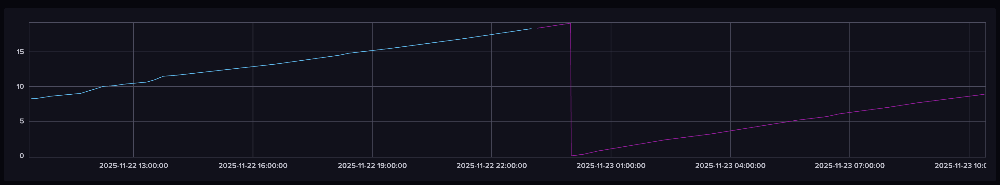

# Home Assistant 2 InfluxDB Exporter

A tool for exporting Home Assistant statistical data to InfluxDB 2.x with intelligent entity filtering, data quality validation, and dual-bucket architecture.

> [!WARNING]  
> This script is experimental, assume that it might harm your production HA database or your Influx database. Do not work without backups


## Features

- **Smart Entity Filtering**: Automatically identifies time-series valuable sensors (energy, power, temperature, etc.) while excluding status indicators and binary states
- **Dual-Bucket Architecture**: Separates recent detailed data from historical compressed data with automated lifecycle management
- **Data Quality Validation**: Detects and auto-corrects common data issues (out-of-range values, NaN states, timestamp anomalies)
- **Resume Capability**: Interrupt and resume large exports with checkpoint system
- **Batch Processing**: Efficiently handles millions of records with configurable batch sizes
- **Comprehensive CLI**: Multiple export modes including dry-run, entity analysis, and selective filtering
- **InfluxDB Automation**: Automatic bucket creation and Flux aggregation task setup
- **Extended Detail Retention**: 90 days vs HA's 10-day default


## Quick Start

### Prerequisites

- Python 3.8+
- Home Assistant with SQLite statistics database
- InfluxDB 2.x instance with API access

### Installation

1. Clone the repository:
```bash
git clone <repository-url>
cd homeassistant-to-influxdb
```

2. Create and activate virtual environment:
```bash
python -m venv venv
source venv/bin/activate  # Linux/Mac
# or
venv\Scripts\activate  # Windows
```

3. Install dependencies:
```bash
pip install -r requirements.txt
```

4. Configure environment:
```bash
cp .env.example .env
# Edit .env with your InfluxDB credentials and Home Assistant database path
```

### Basic Usage
> [!TIP]
> I recommend downloading the HA database to your local machine - so you can run this script there. 


1. **Analyze your entities** (recommended first step):
```bash
python scripts/export.py analyze-entities
```

2. **Run dry-run** to preview what will be exported:
```bash
python scripts/export.py export --dry-run
```

3. **Setup InfluxDB buckets and tasks**:
```bash
python scripts/setup_influx.py
```

4. **Perform the export**:
```bash
python scripts/export.py export
```

## Configuration

Create a `.env` file with your configuration:

```env
# InfluxDB Configuration
INFLUX_URL=http://localhost:8086
INFLUX_TOKEN=your-influx-token
INFLUX_ORG=your-org
INFLUX_BUCKET_RECENT=ha_recent
INFLUX_BUCKET_HISTORICAL=ha_historical

# Home Assistant Database
HA_DB_PATH=/path/to/home-assistant_v2.db

# Processing Configuration
BATCH_SIZE=1000
MAX_RETRIES=3
ENABLE_DATA_VALIDATION=true
AUTO_CORRECT_ISSUES=true

# Entity Filtering (expanded sensor support)
INCLUDE_UNITS=kWh,W,°C,°F,kB/s,GB,MB,A,V,hPa,bar,mbar,lux,ppm,dB,rpm
INCLUDE_SOURCES=tibber
EXCLUDE_PATTERNS=%availability%,%status%,%signal%,%connected%
```

## Architecture

### Entity Filtering Strategy

The exporter intelligently categorizes entities into 8 sensor types:

- **Energy sensors** (kWh): Cumulative energy consumption
- **Power sensors** (W): Instantaneous power readings  
- **Temperature sensors** (°C, °F): Environmental temperature
- **Environmental sensors** (hPa, bar, mbar, %): Pressure, humidity
- **Network sensors** (kB/s, GB, MB): Bandwidth and data usage
- **Electrical sensors** (A, V): Current and voltage
- **Light sensors** (lux): Illuminance and brightness monitoring
- **Air quality sensors** (ppm): CO2, gas detection, air quality
- **Sound sensors** (dB): Noise level monitoring
- **Motion sensors** (rpm): Fan speeds, motor monitoring
- **Special integrations**: Energy providers (e.g., Tibber)
- **Other numeric sensors**: Additional measurements with meaningful units

**Filtering Results**: Typically selects ~80-85% of entities (340+ from 430+ total) for time-series relevance with expanded sensor support.

### Data Processing Pipeline

1. **Entity Discovery**: Scan Home Assistant database for statistical entities
2. **Intelligent Filtering**: Apply unit-based and pattern-based filters
3. **Data Quality Validation**: Detect and correct common issues
4. **Batch Export**: Process data in configurable batches with progress tracking
5. **InfluxDB Integration**: Write to appropriate buckets with proper tags and fields

### InfluxDB Schema

**Tags**: `entity_id`, `sensor_type`, `unit_of_measurement`, `domain`
**Fields**: `mean`, `min`, `max`, `sum`, `state`
**Timestamp**: Preserved from Home Assistant (`start_ts`)

### Dual-Bucket Architecture

The exporter implements a smart two-bucket strategy for optimal storage and performance:

#### **Recent Data Bucket** (`homeassistant-recent`)
- **Retention**: 90 days
- **Purpose**: High-resolution data for dashboards and real-time analysis
- **Data**: Raw statistical records with all fields (mean, min, max, sum)  
- **Update frequency**: Continuous from migration + live HA data

#### **Historical Bucket** (`homeassistant-historical`) 
- **Retention**: Unlimited (permanent storage)
- **Purpose**: Long-term trends and analytics
- **Data**: Aggregated data for efficient storage
- **Update frequency**: Automated via Flux tasks

#### ⚙**Flux Aggregation Tasks**

The exporter automatically creates InfluxDB tasks that aggregate data from recent → historical:

```flux
// Example: Hourly energy aggregation
from(bucket: "homeassistant-recent")
  |> range(start: -1h)
  |> filter(fn: (r) => r._measurement == "kWh")
  |> aggregateWindow(every: 1h, fn: last) // Preserve cumulative values
  |> to(bucket: "homeassistant-historical")
```

**Task Schedule**: 
- **Energy sensors** (kWh): `last()` aggregation (preserves cumulative)
- **Power sensors** (W): `mean()` aggregation (average consumption)
- **Temperature sensors** (°C): `mean()` aggregation (environmental trends)
- **Other sensors**: Appropriate aggregation based on data type

**Benefits**:
- **Extended Detail Retention**: 90 days vs HA's 10-day default
- **Query Performance**: Fast dashboards with recent high-resolution data
- **Storage Efficiency**: Compressed historical data for long-term trends
- **Automated Lifecycle**: No manual data management required
- **Unified Queries**: Seamless access to both recent and historical timeframes

### Migration Example



This InfluxDB chart shows a (almost) **seamless migration in action**:
- **Blue line**: Historical data migrated from Home Assistant
- **Purple/Pink line**: Live data written directly by Home Assistant to InfluxDB
- **Transition point**: Around 23:00, showing good continuity


**Key Benefits Demonstrated**:
- ✅ **Zero data gaps** during migration
- ✅ **Perfect alignment** between historical and live data  
- ✅ **Continuous operation** - HA can write to InfluxDB while migration runs
- ✅ **Unified timeline** - Single view of past + present data

> **💡 Pro Tip**: You can run the migration while Home Assistant is already configured to write to InfluxDB. The data sources complement each other perfectly!

## CLI Commands

### Export Commands

```bash
# Full export with default settings
python scripts/export.py export

# Dry-run to preview without writing
python scripts/export.py export --dry-run

# Resume interrupted export
python scripts/export.py export --resume

# Export specific sensor types only
python scripts/export.py export --sensor-types energy,power

# Skip data validation (faster but less reliable)
python scripts/export.py export --no-validation
```

### Analysis Commands

```bash
# Analyze entity distribution
python scripts/export.py analyze-entities

# Show data quality issues without fixing
python scripts/export.py validate-data
```

### Utility Scripts

```bash
# Setup InfluxDB buckets and aggregation tasks
python scripts/setup_influx.py

# Estimate InfluxDB storage requirements
python scripts/estimate_bucket_size.py
```

## Data Quality Features

### Automatic Issue Detection

- **Out-of-range values**: Detects impossible readings (e.g., temperature > 100°C for indoor sensors)
- **NaN states**: Identifies and handles non-numeric values
- **Timestamp anomalies**: Validates chronological order and reasonable ranges
- **Unit consistency**: Ensures measurements match expected units

### Issue Correction

- **Range clamping**: Constrains values to reasonable bounds
- **NaN replacement**: Substitutes with interpolated or default values
- **Timestamp normalization**: Corrects timezone and format issues

## Monitoring and Troubleshooting

### Progress Tracking

The exporter provides real-time progress updates:
- Entities processed and remaining
- Current processing rate (entities/second)
- Data quality issues detected and corrected
- InfluxDB write performance metrics

### Resume Capability

Exports can be safely interrupted and resumed:
- Progress saved to `export_checkpoint.json`
- Automatic detection of partial exports
- Intelligent restart from last successful batch

### Common Issues

**InfluxDB Connection Errors**:
- Verify token permissions (read/write access to buckets)
- Check network connectivity and firewall settings
- Ensure InfluxDB 2.x compatibility

**Database Access Issues**:
- Verify Home Assistant database path
- Ensure read permissions for SQLite file
- Check for database locks (stop Home Assistant temporarily if needed)

## Development

### Project Structure

```
hastats/
├── src/                    # Core library modules
│   ├── config.py          # Configuration management
│   ├── database.py        # Home Assistant database interface
│   ├── entity_filter.py   # Entity filtering logic
│   ├── influxdb_client.py # InfluxDB integration
│   ├── data_processor.py  # Data validation and processing
│   └── exporter.py        # Main export orchestration
├── scripts/               # CLI scripts and utilities
├── config/                # Configuration templates and examples
├── ADR/                   # Architecture Decision Records
└── requirements.txt       # Python dependencies
```

### Testing

```bash
# Install development dependencies
pip install -r requirements-dev.txt

# Run entity analysis
python scripts/export.py analyze-entities

# Test with dry-run
python scripts/export.py export --dry-run --limit 1000
```

### Contributing

1. Fork the repository
2. Create a feature branch
3. Make your changes with appropriate tests
4. Update relevant ADR documentation
5. Submit a pull request

## Architecture Decision Records

This project uses ADRs to document architectural decisions. See the [ADR directory](ADR/) for detailed decision rationale including:

- Data source analysis and export strategy
- Entity filtering implementation
- InfluxDB architecture and bucket design
- Data processing and validation approach

## License
This project is licensed under [MIT](LICENSE)


## Acknowledgments

- Home Assistant team for the excellent platform and database design
- InfluxDB team for the robust time-series database
- Python community for the excellent libraries used in this project